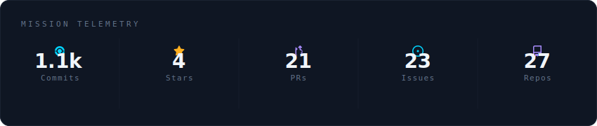

<h3>Miguel Ryan Dantas de Freitas</h3>

Estudante de Engenharia de Computação no IFPB (61%). Faço Residência em TIC e Capacitação em Sistemas Embarcados, ambas pelo Virtus CC, além de projetos de extensão para próprio IFPB.

  

 

  

